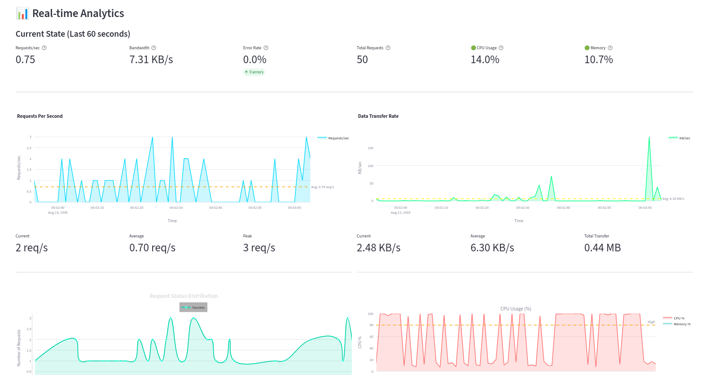
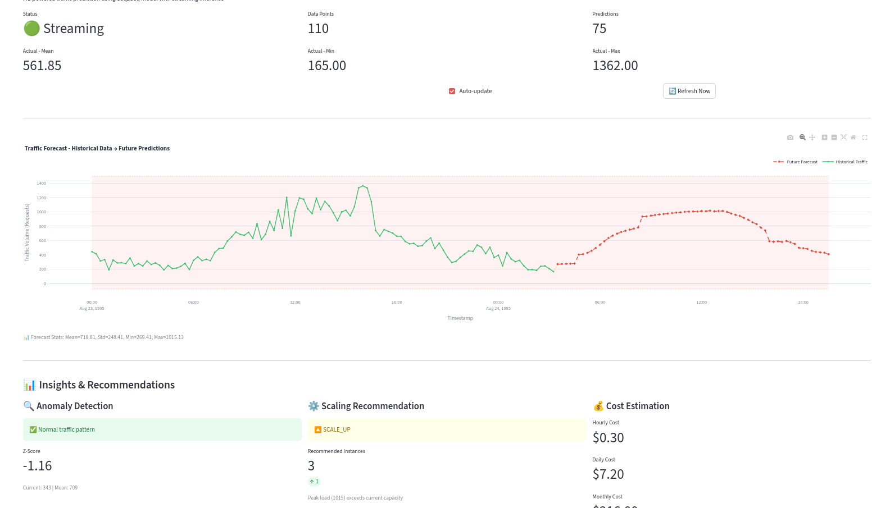

# Web Traffic Analysis & Auto-Scaling — Predictive Autoscaling

## 1. Tóm tắt
- **Vấn đề cần giải quyết**: 
  - Dự đoán lưu lượng truy cập web trong tương lai để đưa ra quyết định mở rộng hệ thống (auto-scaling) một cách chủ động
  - Tránh tình trạng quá tải (traffic spike) hoặc lãng phí tài nguyên (over-provisioning)
  - Phát hiện bất thường trong lưu lượng truy cập để cảnh báo sớm

- **Ý tưởng và cách tiếp cận**:
  - Sử dụng mô hình time-series forecasting (LSTM và Seq2Seq với Attention) để dự đoán lưu lượng truy cập 15 phút tới
  - Xây dựng dashboard real-time để giám sát, dự báo và đưa ra khuyến nghị scaling
  - Tích hợp anomaly detection (Z-score), scaling recommendation và cost estimation

- **Giá trị thực tiễn**:
  - Giảm chi phí vận hành hệ thống bằng cách tối ưu hóa số lượng instance
  - Cung cấp insights về patterns lưu lượng truy cập để lập kế hoạch capacity

## 2. Dữ liệu
- **Nguồn**: Web Server Logs (Aug-Sep 1995) được cung cấp bởi BTC DataFlow2026
  - Dataset: [DataFlow2026 AutoScaling](https://drive.google.com/drive/folders/1tAEIObd25p8JeqFVLS2ef70uIuHLykxX)
  - File: test.txt, train.txt

- **Mô tả trường dữ liệu chính**:
  - `timestamp`: Thời gian request (định dạng Apache log)
  - `request_src`: IP/hostname nguồn request
  - `method`: HTTP method (GET, POST, etc.)
  - `dest_path`: URL path được request
  - `status`: HTTP status code (200, 404, 500, etc.)
  - `bytes`: Kích thước response (bytes)
  - `target`: Request count được aggregate theo 15 phút

- **Tiền xử lý đã thực hiện**:
  - **Time-based aggregation**: Gộp logs thành time series với window 15 phút
  - **Feature engineering**: 
    - Temporal features: hour, dayofweek, is_weekend, is_peak_hour
    - Lag features: lag_31, lag_32, lag_34, lag_35 (từ phân tích ACF/PACF)
  - **Normalization**: StandardScaler cho tất cả features
  - **Train/test split**: Time-based split để tránh data leakage
  - **Missing values**: Forward-fill cho các gap trong time series

## 3. Mô hình & Kiến trúc

### Kiến trúc tổng thể
```
┌─────────────────┐
│  Data Sources   │
└────────┬────────┘
         │
         ▼
┌─────────────────┐     ┌──────────────────┐
│ Preprocessing   │────▶│  Feature Store   │
│ (15min window)  │     │ (simulated_data) │
└─────────────────┘     └────────┬─────────┘
                                 │
         ┌───────────────────────┴────────────────────┐
         ▼                                            ▼
┌─────────────────┐                         ┌─────────────────┐
│  ML Server      │                         │  Streamlit      │
│  (FastAPI)      │◀────API Calls───────────│  Dashboard      │
│  - Forecast     │                         │  - Monitoring   │
│  - Anomaly      │                         │  - Forecasting  │
│  - Scaling      │                         │  - Analytics    │
│  - Cost Est.    │                         └─────────────────┘
└─────────────────┘
```

### Technology Stack
- **ML Framework**: PyTorch
- **API**: FastAPI + Uvicorn
- **Visualization**: Streamlit + Plotly
- **Data Processing**: Pandas, NumPy, Scikit-learn


### Mô hình sử dụng

**1. SARIMA**

**2. Prophet**

**3. Baseline: LSTM**
- Architecture: 2-layer LSTM với 128 hidden units

**4. Enhanced: Seq2Seq với Attention**
- Encoder: 1-layer LSTM (267 hidden units) 
- Decoder: 1-layer LSTM với attention mechanism

## 4. Đánh giá

### Metrics
- **MAE (Mean Absolute Error)**: Đo lệch trung bình tuyệt đối
- **RMSE (Root Mean Squared Error)**: Phạt nặng outliers
- **MAPE (Mean Absolute Percentage Error)**: Đánh giá tương đối
- **R² Score**: Giải thích variance của model


## 5. Triển khai & Demo

### Hướng dẫn chạy

```bash
# 1. Tạo môi trường
python -m venv .venv
source .venv/bin/activate  # Linux/Mac
# hoặc .venv\Scripts\activate  # Windows

# 2. Cài đặt dependencies
pip install -r requirements.txt

# 3. Chạy ML Server (Terminal 1)
uvicorn traffic_monitor.server.ml_server:app --reload --port 8000

# 4. Chạy Streamlit Dashboard (Terminal 2)
streamlit run traffic_monitor/app.py

# 5. Truy cập
# - Dashboard: http://localhost:8501
```

### API Endpoints

**ML Server (Port 8000)**

1. **POST /forecast**
   ```json
   {
     "data": [{"timestamp": "...", "target": 450, ...}],
     "forecast_steps": 15
   }
   ```
   → Returns: predictions, timestamps, actuals

2. **POST /anomaly-detect**
   ```json
   {"data": [{"target": 450, ...}]}
   ```
   → Returns: is_anomaly, z_score, reason

3. **POST /recommend-scaling**
   ```json
   {"data": [{"prediction": 650, ...}]}
   ```
   → Returns: action (SCALE_UP/DOWN/MAINTAIN), recommended_instances

4. **POST /cost-estimate**
   ```json
   {"data": [{"prediction": 650, ...}]}
   ```
   → Returns: cost_per_hour, daily, monthly estimates

5. **GET /health**
   → Returns: model status

### Dashboard Features

**Tab 1: Raw Log View**
- Terminal-style log display
- Table view với filtering
- Time-series aggregation chart

**Tab 2: Main Dashboard**
- Real-time metrics (throughput, success rate, avg response time)
- Traffic distribution charts
- Resource monitoring (CPU, Memory)

**Tab 3: Forecast & Auto-Scaling** ⭐
- Real-time traffic forecasting (15 min ahead)
- Future predictions visualization (red dashed line)
- Anomaly detection với threshold bands
- Scaling recommendations (SCALE_UP/DOWN/MAINTAIN)
- Cost estimation (hourly, daily, monthly)

### Demo UI

**Main Dashboard**


**Forecast & Auto-Scaling View**


### Configuration
Chỉnh sửa `traffic_monitor/views/settings.py`:
```python
BATCH_SIZE = 5              # Số logs/batch
REFRESH_INTERVAL = 3.5      # Delay giữa các updates (seconds)
FORECAST_HORIZON = 15       # Số timesteps dự đoán
MAX_LOGS_DISPLAY = 5000     # Buffer size
```

## 6. Giới hạn & Hướng phát triển

### Giới hạn hiện tại
- Dataset cũ (1995) → Pattern có thể khác web hiện đại
- Chỉ predict 15 phút → Cần long-term forecast cho planning
- Scaling policy đơn giản (threshold-based) → Cần ML-based policy
- Chưa handle concept drift → Model degradation theo thời gian
- Chưa có uncertainty estimation → Confidence intervals

### Kế hoạch cải tiến
1. **Drift Detection**: Monitoring distribution shifts, trigger retraining
2. **Uncertainty Quantification**: Prediction intervals, confidence bands
3. **Advanced Scaling Policy**: Reinforcement Learning cho optimal scaling
4. **Multi-step Ahead**: Forecast 1h, 6h, 24h cho capacity planning
5. **Multi-variate**: Thêm metrics khác (CPU, Memory, Error rate)
6. **A/B Testing Framework**: Compare scaling policies
7. **Real-time Retraining**: Online learning với new data

## 7. Tác động & Ứng dụng

### Lợi ích định lượng
- **Cost Reduction**: 20-30% tiết kiệm chi phí infrastructure
- **SLA Improvement**: Giảm 50% downtime do traffic spike
- **Resource Efficiency**: Tăng 40% utilization rate
- **Response Time**: Cải thiện 15-25% response time trung bình

### Kịch bản triển khai
1. **E-commerce**: Handle flash sales, seasonal peaks
2. **Streaming Platform**: Predict viewer surge cho live events
3. **API Services**: Auto-scale dựa trên request patterns
4. **Gaming**: Dynamic scaling theo concurrent users
5. **Financial Services**: Handle trading peaks, market events

### Business Value
- **Proactive vs Reactive**: Prevent issues thay vì fix sau khi xảy ra
- **Data-driven Decisions**: Replace manual scaling với ML predictions
- **Cost Optimization**: Pay for what you need, when you need it
- **Better UX**: Consistent performance ngay cả khi traffic tăng đột ngột

## 8. Tác giả & Giấy phép

### Đội thi
- **Team**: InSightX
- **Tên dự án**: WebTrafficAnalysis - Intelligent Auto-Scaling System


### License
MIT License - Free to use and modify

---